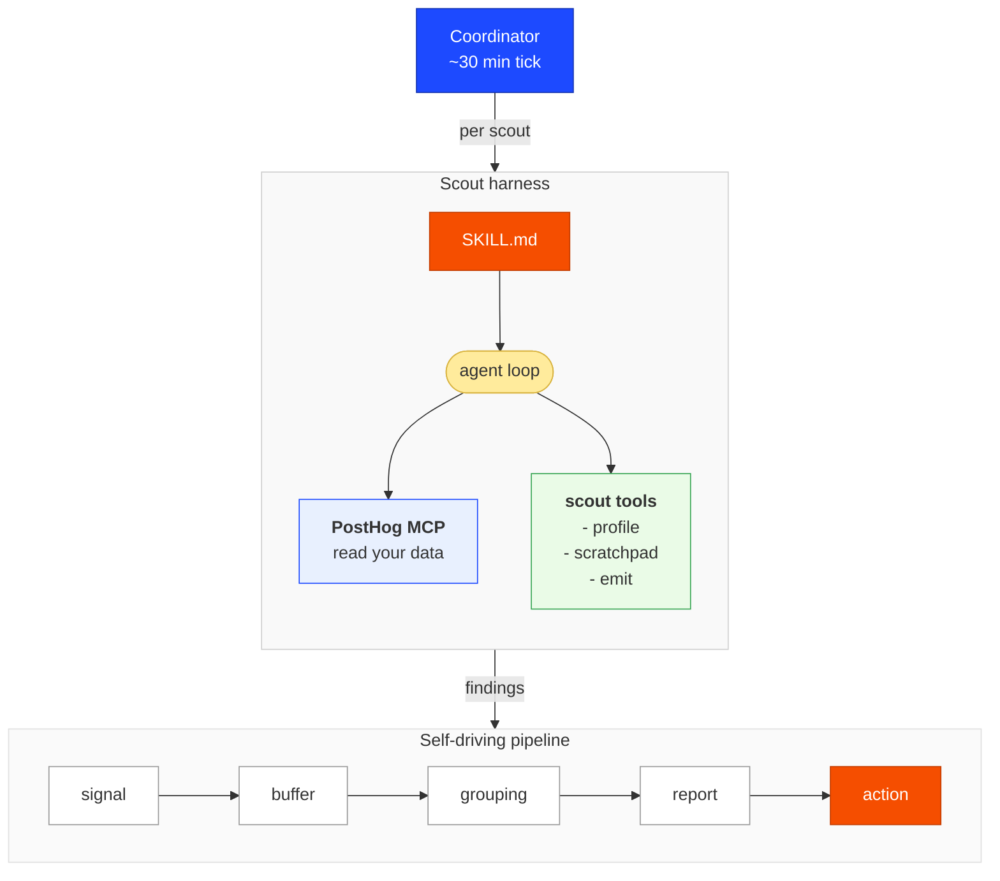

A scout is a small agent (don't overthink that word) that looks at, wrangles, and makes sense of any data available in PostHog. It's a core component of [Self-driving](/docs/start-here) in PostHog (now in open beta), an autonomous loop that monitors your product for patterns and drafts fixes. 

A scout's job is to emit useful **signals** – things worth knowing – that you or your agents can act on. Sometimes that action happens automatically, like an agent opening a PR to fix what the scout found, sometimes it needs some human judgement before you and your agent can tackle it together.

A scout is, at its core, **a skill** – and that skill is the main interface everyone works through, human or agent. The business logic that used to be a sprawl of `if/else` branches and helper functions now starts life as a few hundred lines of English anyone can read, write, and improve (obligatory [Karpathy tweet](https://x.com/karpathy/status/1617979122625712128)).

You can't get away with this for every data pipeline – plenty still needs determinism – but where you have the flexibility, the trade-offs are increasingly worth it.

This post walks through how scouts work in PostHog, with two real scouts we run on our own project – one that [watches agent-driven MCP feedback](#1-the-mcp-feedback-scout-the-code-one), and one that [watches what the internet says about us](#2-the-brand-mentions-scout-the-non-code-one).

This is the deep dive. If you just want the short version, the [Self-driving docs](/docs/start-here) walk the whole [self-improving loop](/docs/start-here/self-improving-loop) – scouts, signals, reports, and the inbox – at a glance. 

If you just want to see scouts in action, skip to [Two example scouts, explained end to end](#two-example-scouts-explained-end-to-end) – there's an ~8 minute video walkthrough of a real scout run there too.

## The scout's role in PostHog's self-driving pipeline

Scouts don't live on their own, they feed our self-driving product pipeline:

1. **A scout runs** on a schedule, looks at some slice of your PostHog data, and decides whether anything is worth surfacing.
2. **If it is, the scout emits a [signal](/docs/start-here/signals)** – a semi-structured finding with evidence, and a suggested action.
3. **Signals get picked up by the [self-driving pipeline](/docs/start-here/self-improving-loop)**, grouped, and turned into **[reports](/docs/start-here/reports)** that land in your PostHog [Inbox](/docs/start-here/inbox).
4. **Reports get actioned** – by you, or automatically by a PostHog Code task that picks up the report and ships a fix or improvement.

A report can be made up of many signals from many sources. Scouts are just one of those sources. 

A single report – say "this MCP tool keeps blowing the token budget" – might be assembled from a scout finding, error tracking, a few raw events, and a health check, all grouped together because they're about the same underlying problem.

Scouts are one (agent-pilled) way PostHog Self-driving detects there's something to do at all. They help [make your product self driving](/blog/self-driving-product) by automating routine papercuts (great for full automation), so you can focus more on strategic judgement work (firmly human still).

## How scouts work

There are really only two parts to a scout: the **skill** that holds all the logic (mostly markdown), and a thin **harness** that runs it on a loop. Here's each in turn.

### Your pipeline can be (mostly) markdown

In a traditional data pipeline, the logic that decides "is this interesting?" lives in code: thresholds, `if/else` branches, helper functions, a scheduler, a pile of glue. Changing what you care about means a code change, a review, a deploy. This is still needed, but for more subjective and flexible pipelines, the agent-pilled approach can offer many benefits.

With a scout, almost all of that logic lives in a **skill** – a markdown file (at a minimum) the agent is told to read and operate by. The skill is where you encode your business knowledge: what's normal, what's noise, what's worth waking a human for. 

What used to be `if response_rate < 0.3 and sample_size > 30:` is now a sentence like *"a flagship NPS survey needs ≥30 responses/week and a ≥10% score drop before it's worth acting on."* That's trivially easy to iterate on and sense check with your agents, and you don't need to be an engineer to do it.

You can be as prescriptive as you like, but in many cases you can just tell the agent what you care about, give it a goal, and let it handle the actual logic. You can then fine tune your agent as it runs by adding dos and don'ts, and other parameters that guide its approach.

Everything else – the loop, the sandbox, the scheduler, the memory – is deliberately thin plumbing around that skill. The [scout harness prompt](https://github.com/PostHog/posthog/blob/master/products/signals/backend/scout_harness/prompt.py), for example, is already too long at 200-ish lines – I need to chip away at that!

"A markdown file" is the lowest possible bar to entry – and for a lot of scouts it's genuinely all you need. But a scout is also a full [Agent Skill](https://agentskills.io/specification), so it scales up the same way any skill does. The `SKILL.md` is the entry point, and a more complex scout can bundle **reference files** the agent loads on demand and **runnable example scripts** for the parts that genuinely want code.

So the spectrum runs from "a few sentences of English" up to "a skill with reference docs and executable scripts" – and the nice part is you start at the easy end and only reach for the heavier machinery when a particular scout actually needs it. 

The really nice thing here is that it's easy to get a feel for this as you can just ask your agent how a scout is performing for your project using the [exploring-signals-scouts](https://github.com/PostHog/posthog/blob/master/products/signals/skills/exploring-signals-scouts/SKILL.md) skill we ship with the [PostHog AI Plugin](https://github.com/PostHog/ai-plugin).

Or even easier just press one of the suggested questions here on the scouts page in PostHog Code. "Make a scout" will use the [authoring-signals-scouts](https://github.com/PostHog/posthog/blob/master/products/signals/skills/authoring-signals-scouts/SKILL.md) skill, scan your project and suggest some custom scouts for you.

### The scout harness

We have a scout harness (yes, I used "harness" – cross it off your bingo card) that is really just a small layer running your scout skills in an agentic loop.

The main ingredients are:

| Ingredient | What it is |
| --- | --- |
| Agent loop runner | The thing that actually pumps the loop (`runner.py`, `arun_signals_scout()`). |
| Tools for the agent | Mostly just the [PostHog MCP](/docs/model-context-protocol) – the same one you can connect to Claude Code or Cursor today. The aim is to build as little custom code as possible; the agent reads your data through the exact tools anyone else gets. |
| Sandbox | An environment to run the loop in, with a project-scoped token so it can only touch the data it's allowed to. |
| Memory | Another bingo word – don't overthink it. Lets a scout be more than a goldfish that forgets everything between runs (see the [scratchpad](https://github.com/PostHog/posthog/blob/master/products/signals/backend/scout_harness/tools/scratchpad.py) tools). |
| Scheduler | Runs the loop regularly. We use [Temporal](https://temporal.io/): a coordinator ticks every ~30 minutes, finds which scouts are due (most run hourly), and fans out one run per scout (see the [coordinator code](https://github.com/PostHog/posthog/blob/master/products/signals/backend/temporal/agentic/scout_coordinator.py)). |

The bulk of what actually *makes* a given scout is its skill – the markdown the agent is told to follow. There are a few small config knobs too (how often it runs, whether it's allowed to emit yet), exposed via the scout-config [MCP tools](https://github.com/PostHog/posthog/blob/master/products/signals/mcp/tools.yaml).

### The "special" tools that make a scout more than a one-shot loop

On top of the normal read-only MCP, a scout gets a handful of scout-only tools:

| Tool | What it does | Code |
| --- | --- | --- |
| `emit-signal` | Push a finding into the pipeline | [Read code](https://github.com/PostHog/posthog/blob/master/products/signals/backend/scout_harness/tools/emit.py) |
| `scratchpad` read/write | A simple, durable, per-project memory | [Read code](https://github.com/PostHog/posthog/blob/master/products/signals/backend/scout_harness/tools/scratchpad.py) |
| past runs & project profile | Lets a run see what previous runs already found and avoid repeating itself | [View code](https://github.com/PostHog/posthog/blob/master/products/signals/backend/scout_harness/tools/profile.py) |

That's it. The scout reads existing inbox reports and prior runs through plain MCP tools; the only genuinely privileged things it can do are *write to its scratchpad* and *emit signals*.

### Dogfood it yourself, then let PostHog run it

Because a scout is just a skill plus the MCP, you can run one manually in any agent surface where the PostHog MCP is available – PostHog Code, Claude Code, Codex, Cursor, whatever. 

This is a key feature, not an accident: you can dogfood a scout on your own project, watch it work against your real data, and tweak the scout until it's good – grounded in actual usage and the pain points you hit on the way.

The thing that's a little different – and makes all the difference – is what happens when **PostHog runs your scouts for you**. 

On the scheduled, sandboxed runs, the scout is allowed to **maintain its scratchpad** and **emit signals into the pipeline**. That permission is what turns a stateless one-shot loop into a long-running agent that learns, adapts, and evolves as your data does – while you steer it just by maintaining the one skill it runs.

## Signal vs noise: What makes a scout good?

The hard part of a scout isn't finding things. It's *not* finding things. A scout that emits on every wobble is worse than no scout at all, because it trains you to ignore them.

So the interesting logic in a scout skill is mostly about restraint, such as:

- **A sense of when to speak up.** A scout's skill tells it to only emit when it's confident the finding is real and worth your attention – otherwise it writes a note to its scratchpad and moves on. Exactly how that bar is expressed is up to each scout, and it's a convention rather than a hard gate, so you can tune how trigger-happy a given scout is.
- **Dedupe keys.** Findings carry stable keys so the pipeline can group repeats and the scout can recognize "I already said this."
- **Disqualifiers.** Explicit lists of things that look like signal but aren't: a single user, a dev-environment burst, a survey at the natural end of its window, an internal test response.
- **Severity** (P0–P4) so downstream routing knows what's a five-alarm fire versus a nice-to-fix.
- ...anything else you decide!

Here's the contrast that makes it concrete. On our brand-mentions scout, a lone *"PostHog is down"* tweet – no detail, no corroboration, one account – got **held below the bar**. 

The same week, a *"PostHog is getting expensive"* complaint that showed up from **multiple independent voices** got **emitted** as a pricing-perception theme. Same surface, opposite decisions, and the reasoning for both is written in plain English in the skill and the scratchpad.

### The scratchpad: How a scout remembers

The scratchpad is a simple key/value store the scout reads at the start of a run and writes to as it goes. It's deliberately low-tech, but it's where the "learning" actually lives. Over time a scout grows a small, legible memory made of a few entry types:

| Element | What it is |
|---|---|
| **A rolling cursor** | "I've processed everything up to timestamp X" – so the next run doesn't re-read the same data |
| **Below-bar carries** | Things not (yet) worth emitting, each with an explicit *promote trigger*: "emit this if a second independent voice echoes it" |
| **Dedupe / addressed entries** | "I already emitted this theme on June 9; don't re-emit unless it escalates past *this* bar" |
| **An evolving tag taxonomy** | The scout curates its own vocabulary for categorizing findings |
| **Cross-links** | Entries reference each other with `[[wiki-style links]]`, so the memory is a little graph, not just a flat list |

Again you can steer your scout to take a different approach to memory here as works best for you.

This is the second half of the markdown thesis: not only did the `if/else` become English, the *database row* became a scratchpad note the agent reads and rewrites every run. You can read a scout's entire scratchpad and understand exactly what it knows and why it's been quiet.

## Making a scout

A scout is 99% a skill, so making one is mostly writing (and iterating on) a skill. You don't do that by hand – you have your agent use the **`authoring-signals-scouts`** skill, which walks it through the anatomy: the emit contract, dedupe and memory conventions, disqualifiers, and the schedule config.

PostHog ships with around 20 **canonical** scouts out of the box – they live in [`products/signals/skills/`](https://github.com/PostHog/posthog/tree/master/products/signals/skills). Here's a sample and high-level things they look for:

| Scout | What it looks for |
|---|---|
| `signals-scout-experiments` | Validity threats like sample-ratio mismatch and zombie experiments |
| `signals-scout-revenue-analytics` | MRR/churn shifts and broken Stripe syncs |
| `signals-scout-surveys` | NPS/CSAT regressions plus recurring themes in open-text responses |
| `signals-scout-web-analytics` | Acquisition channels diverging, attribution breakage, 404 spikes |
| `signals-scout-feature-flags` | Evaluation cliffs, ghost flags, and flag debt |

You can also write your own **custom** scouts for anything you care about – again, just point your agent at `authoring-signals-scouts`. Here are some internal ones we've built recently to dogfood the system:

| Scout | What it watches |
|---|---|
| `signals-scout-mcp-feedback` | Feedback that AI agents file about our MCP server |
| `signals-scout-brand-mentions` | What people say about PostHog across the internet |
| `signals-scout-discord-feedback` | Our community Discord, for bugs and feature requests |
| `signals-scout-self-improvement` | The *other scouts* – flags ones that are miscalibrated or broken |

And to see how your scouts are doing, there's (you guessed it) an [**`exploring-signals-scouts`**](https://github.com/PostHog/posthog/blob/master/products/signals/skills/exploring-signals-scouts/SKILL.md) skill – it surveys the fleet, reads recent runs, inspects the scratchpad, and assesses each scout's health.

## Two example scouts, explained end to end

This is all a little hand-wavy so far, so let's trace two real scouts we run on our own project – one at the bottom of the [self-driving product pyramid](/blog/self-driving-product) (an auto-fixable code paper-cut) and one nearer the top (judgment work a human owns).

Prefer to watch? Here's an ~8 minute walkthrough of a real run of the MCP feedback scout below – me clicking through an actual scout run end to end, from what it read to what it emitted.

<iframe
    width="560"
    height="315"
    src="https://www.youtube-nocookie.com/embed/I5S3vAgkgfI"
    title="A scout run, end to end: the MCP feedback scout"
    frameborder="0"
    allow="accelerometer; autoplay; clipboard-write; encrypted-media; gyroscope; picture-in-picture"
    allowfullscreen
></iframe>

### 1. The MCP feedback scout (the code one)

`signals-scout-mcp-feedback` (you can see [it's a fairly simple skill](https://gist.github.com/andrewm4894/4aef57ab4b31fe78b889d1a2f94fa490)) watches a single event: `mcp feedback submitted`. 

When an AI agent (Claude Code, Cursor, etc.) hits friction using our MCP – a confusing schema, a tool that returns the wrong thing, a missing capability – it can file a structured report via the MCP's own `agent-feedback` [tool](https://github.com/PostHog/posthog/blob/master/services/mcp/src/tools/feedback/submit.ts). 

That report becomes an event. The scout's job is to turn that low-volume, high-signal stream into actionable findings for the MCP team.

Here's one finding the whole way through that pipeline – a single agent's gripe becoming a PR. Each hop is a box: skim the summaries for the shape, or pop one open to see the actual artifact.

Step 1: <strong>An agent files feedback</strong> – <code>view-update</code> quietly drops the <code>sync_frequency</code> it advertises

On June 12th an agent set out to *"set a materialized view's refresh cadence to 12 hours"* – and couldn't. It filed this through the MCP's own `agent-feedback` tool:

> **What broke:** `view-update`'s description promises a `sync_frequency` parameter ('24hour', '12hour', '6hour', …), but its input schema has no such property and sets `additionalProperties: false`. Calling `view-update {id, sync_frequency: '12hour'}` (tried both normal and `--json`) returns 200 with the value unchanged – the param is silently dropped, no error. `view-materialize` always sets 24h and exposes no frequency arg either, so there's no MCP path to a non-default cadence.
>
> **Suggested fix:** Add `sync_frequency` (enum `1min`…`30day`/`never`) to the `view-update` input schema so it's actually forwarded, or add a dedicated `view-set-sync-frequency` tool.

*`sentiment: negative` · `category: tool_input_schema` · `task_completed: false` · via `posthog-code`*

Step 2: <strong>The scout emits a signal</strong> – it spots the silent-drop is now <em>blocking</em> and re-surfaces it

The next run read that event and emitted a finding – recognizing the defect wasn't new, and that it had crossed a line:

> **`view-update`'s documented `sync_frequency` parameter is absent from its input schema, so the value is silently dropped – and it has now hard-blocked an agent (`task_completed=false`), two days after we first flagged it at P3 with no fix shipped.**
>
> This is an *escalation update*, not a new discovery: the same defect was already emitted on 2026-06-10 at P3 – but every prior report was `mixed` / `task_completed=TRUE` (annoying but recoverable). The 06-12 report is the first `negative` / `task_completed=FALSE`. The silent drop rides the *success* path, so `$mcp_is_error` never catches it – only agent feedback surfaces it.
>
> **Fix (reporter-supplied, verbatim):** Add `sync_frequency` to the `view-update` input schema so it's actually forwarded to the saved-query PATCH, or add a dedicated `view-set-sync-frequency` tool.

*finding `mcp-feedback-view-update-sync-frequency-blocks-2026-06-12` · P3 · confidence 0.74*

Step 3: <strong>It becomes an inbox report</strong> – root-caused and marked immediately actionable

The pipeline turned the signal into a report, which even did the root-cause analysis:

> **fix(data-warehouse): expose `sync_frequency` in view-update MCP schema** – P3, *immediately actionable*
>
> **Root cause:** `sync_frequency` is declared as `serializers.SerializerMethodField()`, which DRF treats as read-only. That makes drf-spectacular mark it `readOnly: true`, so Orval omits it from the writable PATCH body, and the MCP `ViewUpdateSchema` never includes it. The backend actually *does* support the write – the serializer reads `sync_frequency` off `request.data` as a side-channel – but the generated schema can't expose what it thinks is read-only.
>
> **How to resolve:** Make `sync_frequency` a writable serializer field so it flows into the generated PATCH body, then regenerate the MCP types; reuse the existing `SyncFrequencyEnum`.

Step 4: <strong>An agent opens the fix</strong> – <a href="https://github.com/PostHog/posthog/pull/63393" rel="noopener noreferrer">PR #63393</a>, authored autonomously

A PostHog Code agent picked up the report and opened the PR on its own – introducing a writable `SyncFrequencyField` so the cadence flows into the generated PATCH body, and adding three regression tests (a writable-field guard, a round-trip update, and an invalid-value rejection).

From the PR's own agent-context section:

> Authored by Claude Code (`claude-opus-4-8`) acting on PostHog inbox report `019ebd3a…`. **Decision:** chose to make `sync_frequency` a writable serializer field over adding a dedicated `view-set-sync-frequency` tool – it's the minimal change that fixes the silent-drop for *all* clients (frontend, API, MCP) at once and follows the existing pattern. Agent-authored – requires human review; do not self-merge.

That's the whole loop this post is about: one piece of agent feedback, turned into a reproducible finding with a verbatim fix, turned into a root-caused report, and picked up by *another* agent – no human in the chain until review.

Those boxes trace one finding end to end. Two behaviors from this scout generalize beyond it, and both show the system *learning*:

| Behavior | How it works |
|---|---|
| **Signals group into reports** | Take a token-blowout the scout flagged in `heatmaps-list`: it didn't spawn a new report, it **grouped into an existing one**, *"Add pagination and field projection to MCP list/schema tools,"* which was already `in_progress`. Multiple scout runs, over days, all noticing flavors of the same underlying problem, converging into one piece of work. |
| **Findings escalate via memory** | Earlier the same day, the scout emitted a P3 about a missing `ensure_experience_continuity` input – and wrote a note in its scratchpad: *"promote to P2 if a second blocked report lands."* When a second agent hit the same wall, the next run read that note, saw the trigger fire, and re-emitted at P2. The escalation rule isn't in any code – it's a sentence the scout wrote to itself. |

### 2. The brand mentions scout (the non-code one)

`signals-scout-brand-mentions` ([you can read it as a gist](https://gist.github.com/andrewm4894/0eb4d6dde2fd10689b7027668a289ad5)) watches what the internet says about PostHog. And the way it gets that data is the point.

**Anything you can land in PostHog is scout-able.** We pipe a social-listening tool (Octolens) into a Slack channel, and that channel is synced into the [PostHog data warehouse](/docs/data-warehouse) as a regular table. 

The scout just queries it with SQL like any other PostHog data. There's nothing special about "analytics events" here – warehouse sources, Slack relays, third-party feeds, all of it becomes fair game for a scout the moment it's in PostHog. This is a big part of why scouts are general-purpose rather than a product-analytics-only feature.

This scout sits higher on the [self-driving pyramid](/blog/self-driving-product) than the MCP one: when it finds something, the action usually isn't a PR – it's comms, product strategy, or just situational awareness. A few real (anonymized) examples it surfaced:

| Finding | What happened |
| --- | --- |
| **A reputational narrative escalating** | A privacy claim about PostHog jumped from niche threads to a large-audience commentator, with the framing shifting to attack PostHog directly (and, notably, inaccurately). The scout emitted a P2 recommending comms/legal own the narrative – citing the two earlier, lower-severity findings it had filed about the same theme as it built. |
| **Us, roasted, repeatedly** | The scout keeps a running "PostHog is too complex / bloated" theme – and the genuinely useful part is watching it decide what's worth your attention. Most of these never clear the bar (one voice, low reach, a matter of taste), so the scout logs each with a deadpan verdict and a "promote if a second voice echoes" trigger, and stays quiet. Pop these open for the actual public roasts – and the scout's clinical reasoning for holding them. |

Pop these open for the actual public roasts and the scout's clinical reason for holding them:

🦔 <strong>"Creeped out by the hedgehog sound"</strong>

> *"Am I the only one who is creeped out by the hedgehog sound posthog code makes every time it finishes a task?"*

The scout's note to itself: *"a real shipped audio cue and the feedback is specific, but n=1, low reach, and a matter of taste → does not clear the bar at n=1. If a 2nd distinct voice complains about the PostHog Code sound, this becomes an emittable P3 (suggest a mute/volume toggle)."*

<strong>"Too complicated, too much noise"</strong> – the too-complex / bloat drip

A steady multi-day trickle, all real, all public:

> *"Am I the only one who hates Posthog UX?"*
>
> *"PostHog. Too complicated, too much noise."*
>
> *"is it just me or the dashboard is so bloated now? 😭 … this thing could've been a sidebar imo"*
>
> *"yeah too much useless features"*
>
> *"not sure what substances @posthog employees take to have that much beef with their UI; they're constantly changing it!"*

The scout's verdict: *"steady multi-day drip, not a spike… all generic, low-reach, no high-reach/press voice. Held below bar. Escalate only if a high-reach voice or a tight cluster of 3+ fresh distinct voices in a single day lands."* It *did* cross that bar once – an r/posthog *"the UX is just terrible (new user rant)"* thread tipped it into an emitted P3.

<strong>"Don't make the AI the first thing I see"</strong> – Max-as-landing-page

> *"as much as i love the posthog ai it shouldn't be the first thing i see when i go to posthog… not the thing i wanna see"*

The sharp bit the scout pulled out: this isn't *"AI bad."* The same accounts praise it (*"they cooked on that thing, it's really really good"*) – the gripe is specifically that the AI is the **default landing screen**, which is a default-setting and discoverability call (there's already an option to customize the landing screen), not a missing feature. Held below bar as a single thread.

All real, all public, all genuinely useful to know in aggregate – and all held back until they actually matter.

And this is the scout whose scratchpad best shows the **memory model evolving**. Across runs it has built up:

- a `pattern:brand_mentions:cursor` entry it overwrites every run (the rolling "I've read up to here" mark),
- a stack of `*-belowbar` carries – *"a user says PostHog's bot-filtering is letting bots through; n=1, low reach – promote if a second independent voice reports the same,"*
- `addressed:*` entries recording every theme it's already emitted and the exact bar for re-emitting,
- and its own `tags:brand_mentions:taxonomy` vocabulary, with entries cross-linked by `[[name]]` references.

You can read that scratchpad top to bottom and reconstruct everything the scout knows, every judgment call it's made, and why it's been quiet on the things it's chosen to stay quiet on. 

That legibility – being able to *audit an agent's memory in plain text* – is, to me, the whole pitch.

## Ideas: what else to point a scout at

Those two are just two shapes. The thing to internalize is that **anything you can land in PostHog is scout-able**, and a scout's whole job is encoded in a skill you can write in an afternoon. Some directions to steal – most of these are scouts we already run on our own project:

| Use case | What it does |
| --- | --- |
| **Mine any Slack channel** | Sync a channel into the [data warehouse](/docs/data-warehouse) and a scout reads it like any other table – a user-feedback channel, an internal team channel (we run one over our own `#team-self-driving`), an external alerting or on-call channel, even a community Discord relay. The moment it's a table, it's fair game. |
| **Watch any custom event** | Scouts aren't limited to analytics events – point one at *any* event you capture: a custom customer-support event, a feedback submission, a domain-specific action. Internally we run separate scouts on PostHog AI thumbs-down feedback, PostHog Code task feedback, and the per-product in-app feedback widgets. |
| **Keep an eye on what you already care about** | Hand a scout a curated set of *your* dashboards, insights, and alerts – the metrics your team checks every morning – and have it stay quiet until one of them actually moves against its own baseline. |
| **Own a funnel or a journey** | A scout can watch your key funnels and activation flows across every PostHog feature you use, flag a conversion or retention regression against the flow's own trailing baseline – and even propose the A/B [experiment](/docs/experiments) to fix the weakest step. |
| **Have it read your codebase** | Give a scout a repo and a job: scan recent code changes and keep your [agent skills](https://agentskills.io/specification) in sync as things move, catch docs that have drifted out of date, flag a feature shipped with no instrumentation, spot a third-party API version about to be deprecated, or run a static-analysis tool over the last week's diffs. |
| **Let it dogfood your own tools** | A scout can *use* your product, not just read it – we run one that random-walks our own [MCP](/docs/model-context-protocol) tool surface and files the rough edges it hits first-hand (and once scouts can reach external MCPs, this extends to whatever you've built). |
| **Point a scout at your scouts** | A meta-scout that audits the rest of the fleet for miscalibration, plus a follow-up scout that re-checks "resolved" reports after a soak window to confirm the fix actually held. |
| **Let findings carry real depth** | When a finding is more than a sentence, a scout can write the charts and supporting queries into a [notebook](/docs/notebooks) and link it from the signal – the inbox stays scannable, and the full analysis is one click away. |

The pattern across all of these: pick a surface you wish someone was watching, write down what *"worth my attention"* means for it in plain English, and let the scout hold that bar for you.

## Where this is going

Scouts today are deliberately narrow: read your data, decide if something's worth knowing, emit a signal. That's the foundation, and keeping it small is the point. But there's a lot of obvious headroom, and a bunch of it is already on the roadmap:

| Direction | What it means |
|---|---|
| **Richer, more visual reports** | Right now a scout emits a structured finding and the pipeline turns it into a report. We want scouts to produce more of that report directly – charts, embedded insights, the actual visual evidence – rather than handing off a block of text for something downstream to dress up. |
| **Scouts that take action, not just surface it** | A finding is only useful if something happens. The natural next step is letting a scout do more than emit: ping you on the right channel, or take a PostHog MCP *write* action on your behalf – keep a dashboard tidy automatically, file an alert, tweak a flag – all within guardrails you set. |
| **Bring your own MCP** | Scouts read PostHog through the PostHog MCP today. There's no reason they should be limited to it. Letting a scout reach an *external* MCP would let it plug into the other tools and systems you already use – your issue tracker, your data stack, your on-call – so a finding can flow straight into where you actually work. |
| **Whole units of work, not just PRs** | A real change is rarely one PR. It's the PR *plus* a tracking dashboard, the feature flag to roll it out, the alert to watch it, and an experiment to prove it worked. The ambition is for a scout (and the agents downstream of it) to assemble that whole collection, not just the code. |
| **Right-sized models** | A scout watching for a simple threshold breach doesn't need the same horsepower as one reasoning across products. Letting simpler scouts run on cheaper, faster base models keeps the fleet economical as it grows. |
| **Smarter triggers** | Scouts run on a schedule today. Time is the simplest trigger, but not always the right one – we want scouts that wake on the *event that matters* (a deploy, a spike, another scout's finding) instead of just waiting for the next tick. |

The pattern here is to lean in and embrace being agent pilled, keep the core tiny and the skill in charge, and let scouts climb the [self-driving pyramid](/blog/self-driving-product) – from noticing, to recommending, to doing.

## Try it yourself

Scouts are still rolling out gradually and are invite-only for now while we shake out the rough edges – wider access is coming soon. If you want in early, email [team-self-driving@posthog.com](mailto:team-self-driving@posthog.com) and we'll get you set up.

Once they're available to you, the home base is [PostHog Code](/code), our desktop coding agent – download it, sign in, and the PostHog MCP is wired up for you. From there you can navigate to the Agents section and explore the set of [canonical scouts](/docs/start-here/scouts) PostHog ships with as well as make your own custom scouts.

## AGI Buzzword bingo

We hit a *lot* of AGI-era buzzwords on the way here. If you've been keeping score, here's your card – how many did we land?

{['B', 'I', 'N', 'G', 'O'].map((letter) => (

{letter}

))}
{[['Agent', 'a for-loop with ambitions', true], ['Memory', 'a .txt file, basically', true], ['Harness', 'a while-loop in a lanyard', true], ['Skills', 'markdown that did a course', true], ['MCP', 'USB-C for LLMs', true], ['Tools', "functions that RTFM'd", true], ['Sandbox', "where it can't break prod", true], ['Agent loop', "the for-loop's TED talk", true], ['Markdown', 'code minus the brackets', true], ['Agent-pilled', 'you, by the end of this', true], ['Signal', 'noise we chose to like', true], ['Scratchpad', 'a sticky note with dreams', true], ['Vibe coding', "git commit -m 'trust me'", false], ['Self-driving', 'not the car. relax.', true], ['Pipeline', 'if/else with a personality', true], ['Ship the loop', 'we said it unironically', false], ['Agent dreaming', 'REM cycles for robots', false], ['Temporal', 'cron with a pitch deck', true], ['"in the weights"', 'the shrug of ML', true], ['Skills-pilled', "agent-pilled's cousin", false], ['Karpathy tweet', 'obligatory. see above.', true], ['Agentic', 'agent, but billable', true], ['Confidence', 'a vibe, to two decimals', true], ['Progressive disclosure', 'telling you later, on purpose', true], ['p(doom)', 'the spiciest float', false], ['Long-running agent', 'a goldfish taking notes', true], ['One-shot', 'no pressure, lil buddy', true], ['Guardrails', "the 'please don't' in prod", true], ['Agent surface', 'where you yell at it', true], ['Dogfood', 'we ate it. it was fine.', true]].map(([word, quip, said]) => (

{said ? '✓' : '✗'}{word}

{quip}{said ? 'said it ✓' : 'never said it ✗'}

))}

(p.s. flip a card for its *real* definition – and the ✗'s are the few we never actually managed to get in)
