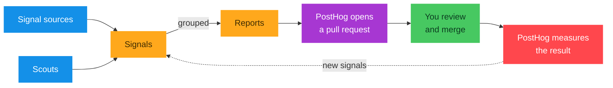

import { QuestLog, QuestLogItem } from 'components/Docs/QuestLog'
import OSButton from 'components/OSButton'
import { IconMessage, IconLaptop, IconMagic } from '@posthog/icons'

New to PostHog? Let's get you on the fast track to using it well: understand how it works, get set up, and start shipping.

<QuestLog firstSpeechBubble="Vroom vroom!" lastSpeechBubble="Happy shipping!">

<QuestLogItem title="PostHog makes your product self-driving" subtitle="The big idea" icon="IconStack">

A self-driving product can prompt itself. PostHog turns your product data into signals, and agents act on those signals to ship improvements, all inside the guardrails you set.

Instead of waiting for someone to notice a bug, file a ticket, and assign it, PostHog spots the pattern in your data, drafts a fix, and opens a pull request for you to review.

It runs as a loop. Scouts and signal sources emit signals, signals group into reports, and an agent investigates each report. 

When a report is actionable, PostHog opens a pull request for you to review and merge; when it needs your input, it surfaces the report in your inbox instead. PostHog then checks whether the change worked and feeds the result back into the next pass.

Self-driving works because the signals that drive the loop live in your product data, and that's exactly what PostHog has. 

A general-purpose coding agent has your code, but not your context. PostHog ties everything together into a [context warehouse](/docs/self-driving/context): your product usage data, your data warehouse, and the context your agents need, in one place. That's what helps your agents do their best work.

</QuestLogItem>

<QuestLogItem title="Set up PostHog" subtitle="Wire in your data" icon="IconRocket">

Self-driving is only as good as the data feeding it. First, [install PostHog](/docs/getting-started/install) with the setup wizard so it's capturing events. Then run our self-driving wizard to turn on your signal sources and set up your scouts. Add the [Slack app](/docs/slack) to bring your whole team in.

Once data is flowing, PostHog will continuously monitor your product and reports begin landing in your inbox. Most teams are set up in a few minutes.

<OSButton variant="primary" asLink to="/docs/self-driving/setup">
    Set up self-driving
</OSButton>

</QuestLogItem>

<QuestLogItem title="Learn the concepts" subtitle="Context, scouts, signals, reports, inbox" icon="IconCode2">

There's a small set of terms worth knowing. Here's a breakdown:

- **[Context](/docs/self-driving/context)** – everything your agents need to know about your product, tied together in your context warehouse. The context a general-purpose agent doesn't have.
- **[Scouts](/docs/self-driving/scouts)** – scheduled agents that watch a slice of your data and raise a hand when something's worth knowing.
- **[Signals](/docs/self-driving/signals)** – what a scout emits: a structured finding, with the evidence behind it and a suggested action. Error tracking, session replay, and tools like Zendesk and Linear emit signals too.
- **[Reports](/docs/self-driving/reports)** – related signals grouped into one item of work, so you deal with the real problem instead of a noisy stream of findings.
- **[Inbox](/docs/self-driving/inbox)** – where reports and pull requests land for you to review, steer, and merge.

Put together, that's the self-improving loop: scouts and sources emit signals, signals become reports, agents open pull requests for the actionable reports and ask for input on the rest, and you stay in control from your inbox.

<OSButton variant="primary" asLink to="/docs/self-driving/self-improving-loop">
  The self-improving loop
</OSButton>

</QuestLogItem>

<QuestLogItem title="Use PostHog from anywhere" subtitle="Slack, Web, and MCP" icon="IconLaptop">

Self-driving meets you where you already work. Pick the surface that fits how you want to work.

### <IconMessage className="text-red w-7 -mt-1 inline-block" /> Slack

Mention `@PostHog` in any channel to ask about your data or put an agent to work. It plans in a sandbox, edits files, and opens a draft pull request, and your whole team can steer in the thread. See the [Slack app docs](/docs/slack).

### <IconLaptop className="text-blue w-7 -mt-1 inline-block" /> Web

The full [PostHog app](https://app.posthog.com), in your browser. Explore your data, watch the signals feeding the loop, and review the work agents propose.

### <IconMagic className="text-purple w-7 -mt-1 inline-block" /> MCP

Bring PostHog's data and tools into Claude Code, Cursor, and other AI tools, so your own agent works with product context, not only code. See the [MCP docs](/docs/model-context-protocol).

</QuestLogItem>

<QuestLogItem title="See it work" subtitle="Your day-to-day" icon="IconFlag">

Once self-driving is running, you don't have to prompt it. Scouts keep watching your product, reports become pull requests, and they land in your [inbox](/docs/self-driving/inbox) ranked by priority. 

The day-to-day is simple: open your inbox, review what's waiting, and merge the changes you're happy with, the same as any other pull request. 

PostHog then checks whether each change moved the metric and feeds the result into the next pass.

<OSButton variant="primary" asLink to="/docs/self-driving/inbox">
  Explore your inbox
</OSButton>

</QuestLogItem>

</QuestLog>
