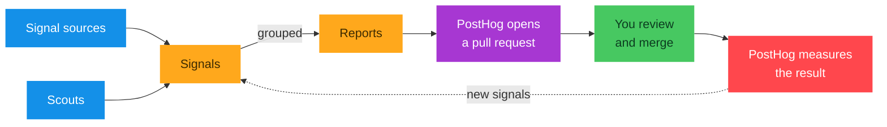

import { CallToAction } from 'components/CallToAction'

<CalloutBox icon="IconInfo" title="Open beta" type="fyi">

Self-driving is currently in open beta.

</CalloutBox>

The self-improving loop is how PostHog turns product data into shipped changes, then checks whether they worked. The [overview](/docs/start-here) has the loop at a glance. This page is how it works under the hood, stage by stage.

## Collect signals

The loop starts with [signals](/docs/start-here/signals), which come from two kinds of source you can turn on independently. **Signal sources** are built-in pipelines that watch one stream continuously, like error tracking, session replay, health checks, Zendesk, GitHub Issues, and Linear. **[Scouts](/docs/start-here/scouts)** run on a schedule and explore your product data more holistically. A single problem usually shows up as several signals at once.

## Group into reports

Raw signals are noisy, so the loop deduplicates them and clusters the ones pointing at the same underlying problem into a single [report](/docs/start-here/reports). Working from one report instead of a stream of alerts is what keeps the loop, and your inbox, focused on real problems.

## Investigate each report

An agent investigates every report. It digs into your codebase and your PostHog data to confirm the problem is real, works out how urgent it is, and decides whether there's a concrete change it could make. The result is a priority and a verdict on whether the report is actionable.

## Open a pull request, or ask for input

What happens next depends on whether the report is actionable:

- If the report is **actionable**, an agent opens a **pull request** for it. The change is built in a sandbox and comes back with your CI and code review attached, like a teammate's PR.
- Otherwise, the report is **surfaced in your inbox for input**, for example when it needs business context or a choice between valid approaches.

Every actionable report gets a pull request, so the work that reaches you already has a proposed change attached. Since [pricing](/docs/start-here/pricing) is per pull request, that's also what you're billed for.

## Review and ship

Nothing reaches production on its own. You review the pull request in your [inbox](/docs/start-here/inbox), ask for changes, and merge or decline it, the same as any other PR. For a report that needs input, you add what's missing and start the work yourself.

## Measure and improve

Once a change ships, PostHog checks whether the metric it targeted actually moved, and the result feeds back in as new signals. So each pass works from better data than the last: better data means sharper signals, and sharper signals mean better-targeted work. That feedback is what makes it a loop rather than a one-shot.

## Next step

Scouts are one of the two ways the loop picks up signals. See how they work.

<CallToAction type="primary" to="/docs/start-here/scouts">
  Scouts
</CallToAction>
